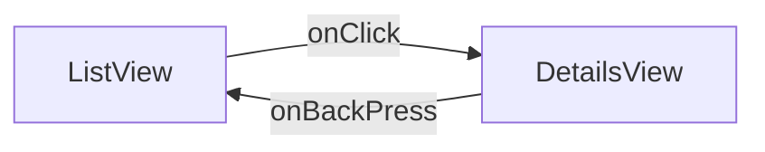

# Welcome to Lottery APP!

The Lottery App reads lottery draw details from a JSON file (added to the project's assets folder) and displays them as a list on the home screen. When you click on individual draws, the app shows a detailed view of the draw. 

Few UI enhancement 
1. Show price money in millions and billions instead of long numbers on screen
2. Show time in a friendly format (like yesterday, today, in 2 hours, etc.)
3. Show single-digit draws in two-digit format (like 2 becomes 02)
4. Show celebration Lottie animations on the detailed screen
5. All UI elements are built as components for reusability and have checks in place for undesired use

## Checklist of Features done 

-  **[Done]** Parse JSON Data: Load and parse the provided JSON data within the app. 
-  **[Done]** Display Lottery Draws: Create a simple view that lists all lottery draws with their respective draw dates.
-  **[InProgress]** Unit and Integration Testing: Write tests to cover critical functionalities of the application.
-  **[Done]** Detail View for Each Draw: Implement a detail view for each lottery draw, showing all numbers and the bonus ball.
-  **[NotDone]** Lottery Tickets: Implement a 'ticket view' that shows some randomly generated lottery tickets and if they have won or not.
-  **[Done]** Navigation: Add basic navigation from the main list view to the detailed views of each draw.
-  **[InProgress]** Additional Tests: Add more thorough testing and improve test coverage.
-  **[NotDone]** Interactive Navigation: Implement swipe gestures to navigate between different draw details.
-  **[NotDone]** Local Storage: Cache the lottery draws locally and allow the app to display the cached data when offline.
-  **[Done]** UI/UX Enhancements: Enhance the visual presentation and user experience of the app using animations or custom UI components.

## List Screen 

  

## Details Screen

